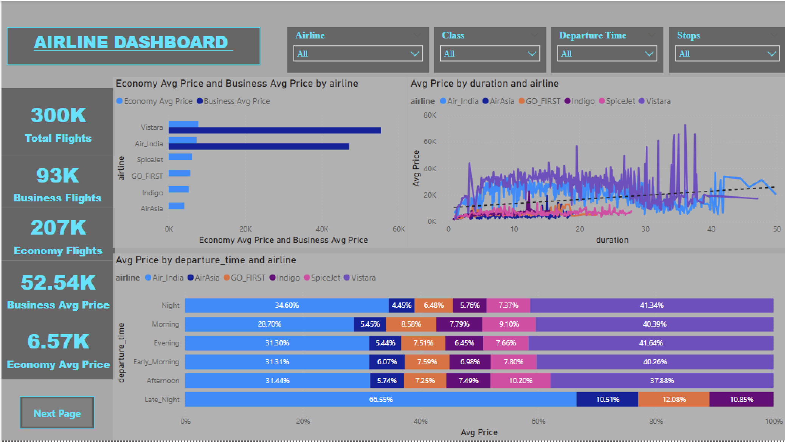

# Airline Price Analysis Dashboard ✈️

This project analyzes the variation in flight ticket prices based on critical factors such as airline brand, class (Economy vs. Business), departure time, and booking windows. The dashboard provides actionable insights for comparing pricing strategies across the aviation industry.

## 📊 Dashboard Preview

*(Note: The dashboard is interactive and contains a navigation button to a second page for detailed deep-dive analytics.)*

## 🎯 Key Business Questions Addressed
This analysis visualizes data to answer the following:
*   **Airline Variance:** Does price vary significantly between specific Airlines?
*   **Booking Timing:** How is the price affected when tickets are bought just 1 or 2 days before departure?
*   **Time of Day:** Does ticket price fluctuate based on departure and arrival times?
*   **Route Analysis:** How does the price change with Source and Destination?
*   **Class Comparison:** What is the price variance between Economy and Business class?

## 🚀 Navigation & Features
*   **Home Page (Shown above):** distinct overview of Total Flights, Avg Prices per Airline/Class, and Price trends by Duration.
*   **Deep Dive (Page 2):** Accessible via the **"Next Page"** button on the bottom left. This hidden page provides granular details on:
    *   Price trends based on "Days Left" (Booking window).
    *   Maximum price fluctuations.
    *   Average price breakdown by Source City.

## 🛠️ Tools Used
*   **Power BI:** For data modeling, DAX calculations, and interactive visualization.
*   **Excel:** Data preprocessing and source.
